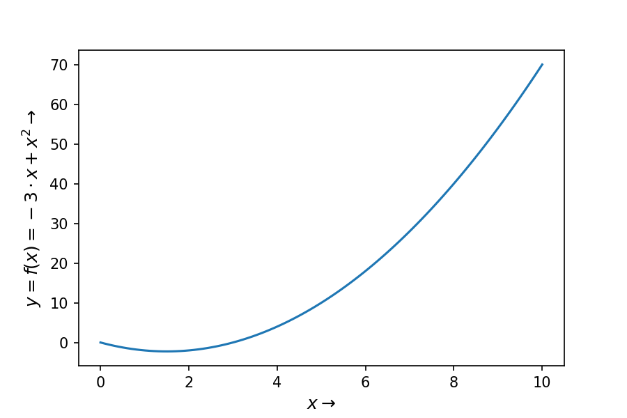
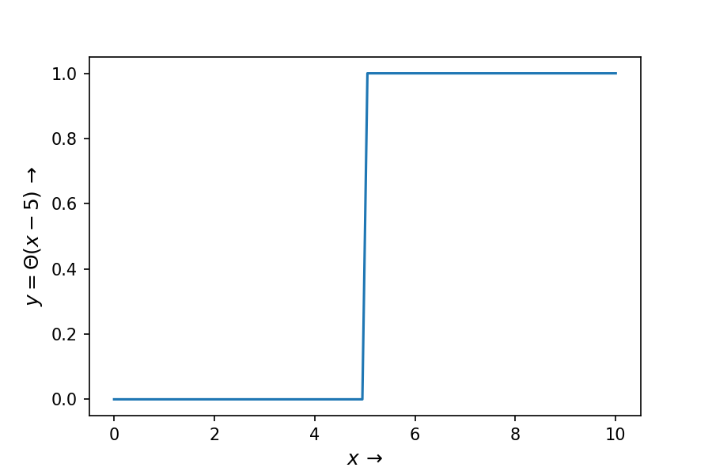

# Eigenschaften

Funktionen können verschiedene Eigenschaften besitzen. Eine wichtige ist die sogenannte Stetigkeit.
Eine stetige Funktion eine Funktion, bei der hinreichend kleine Änderungen des Arguments nur beliebig kleine Änderungen des Funktionswerts nach sich ziehen.

|Beispiel einer stetigen Funktion | Beispiel einer in $x=5$ nicht stetigen Funktion |
|- | - |
| | |