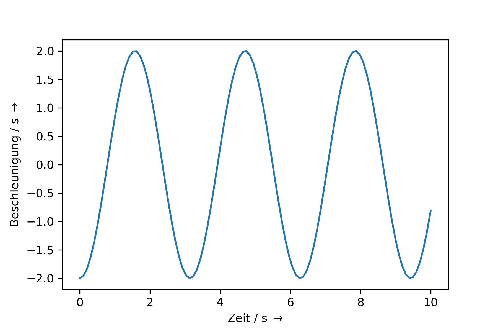

# Beispiele zur eindimensionalen Bewegung eines Massenpunktes

## Beispiel 1: a aus x

Gegeben sei folgender Zusammenhang zwischen x und t zur Beschreibung der Bewegung eines Massenpunktes

$x(t) = t \cdot \sqrt{t} + 5 t^3$

Wie sehen Geschwindigkeit und Beschleunigung aus?

**Lösung:**

$x(t) = t \cdot \sqrt{t} + 5 t^3 = t^{3/2} + 5 t^3$

$v(t) = \frac{d}{dt} x(t) = \frac{d}{dt} \left(t^{3/2} + 5 t^3 \right) = \frac{3}{2} t^{1/2} + 5\cdot 3 t^2 = \frac{3}{2} t^{1/2} + 15 t^2$

$a(t) = \frac{d}{dt} \left( \frac{3}{2} t^{1/2} + 15 t^2 \right) = \frac{3}{2} \frac{1}{2}t^{-1/2} + 2\cdot 15 t = \frac{3}{4} \frac{1}{\sqrt{t}}+ 30 t$

## Beispiel 2: x aus a

Ein Massenpunkt erfährt eine Beschleunigung von 

$a = 3 \cdot t$.

Wie lauten die Funktionen für $v(t)$ und $x(t)$?
Zu Beginn der Bewegung hat der Massenpunkt eine Geschwindigkeit von 

$v(0) = 0$

und 

$x(0) = 0$.

**Lösung:**

$v(t) = \int a(t) \, dt = 3\frac{1}{2} t^2 + v(0) = \frac{3}{2} t^2$

$x(t) =  \int v(t) \, dt  = \frac{3}{2} \frac{1}{3} t^3 + v(0)\cdot t + x(0) = \frac{1}{2} t^3$

## Beispiel 3: freier Fall

Ein Ball, der als Massenpunkt betrachtet werden kann, fällt aus einer Höhe $h$ zu Boden.

```{figure} Bilder/freier_fall.png
---
width: 400px
name: freefall-1
---
Darstellung des freien Falls.
 ```

- Nach welcher Zeit erreicht der Ball die Erdoberfläche?
- Wie ändert sich die Situation, wenn die Richtung des gewählten Koordinatensystems umgekehrt wird und der Nullpunkt an den Start gesetzt wird?
- Wie ändert sich die Situation, wenn der Ball mit $v_0 = 2 \frac{m}{s}$aus einer Höhe von $h= 10 \, m$  nach oben geworfen wird?
- Nach welcher Zeit erreicht der Ball den oberen Umkehrpunkt und in welcher Höhe ist dieser?

**Lösung:**

Im freien Fall wirkt auf einen Massenpunkt (in Oberflächennähe) die konstante Ergbeschleunigung $a = -g$. 
Die Geschwindigkeit ist demnach

$v(t) = -g \cdot t + v_0$

Wird der Ball in Höhe $h$ losgelassen, ist in diesem Punkt die Geschwindigkeit $v(t = 0) = v_0 = 0$. Damit wird 

$v(t) = -g \cdot t$

Für die Position gilt

$x(t) = - \frac{1}{2} g t^2 + x_0$

wobei $x_0$ die Anfangshöhe h ist. Somit gilt

$x(t) = - \frac{1}{2} g t^2 + h$

Kommt der Ball an der Erdoberfläche an, ist $x(t_e) = 0$. Damit ist die dazugehörende Zeit

$x(t_e) = - \frac{1}{2} g t_e^2 + h = 0 \Leftrightarrow \frac{1}{2} g t_e^2 = h \Leftrightarrow t_e = \sqrt{\frac{2h}{g}}$

Wird die Richtung des gewählten Koordinatensystems umgekehrt und der Nullpunkt an den Start gesetzt, ergibt sich folgendes Bild

```{figure} Bilder/freier_fall_2.png
---
width: 400px
name: freefall-2
---
Darstellung des freien Falls.
 ```

$a = g$

$v(t) = g \cdot t$

$x(t) = \frac{1}{2} g t^2$

und 

$x(t_e) = h$

Damit ergibt sich

$h = \frac{1}{2} g t^2 \Leftrightarrow t_e = \sqrt{\frac{2h}{g}}$

Wenn der Ball mit $v_0 = 2 \frac{m}{s}$ aus einer Höhe von $h= 10 \, m$ nach oben geworfen wird, gibt es zum Zeitpunkt $t=0$ eine Anfangsgeschwindigkeit, die der Beschleunigung entgegen gesetzt wird.
Beim unsprünglichen Koordinatensystem bedeutet dies

$v(t) = -g \cdot t + v_0$

$x(t) = - \frac{1}{2} g t^2 + v_0\cdot t + h$

Damit wird

$x(t_e) = 0 = - \frac{1}{2} g t^2 + v_0\cdot t + h \Leftrightarrow t^2 = t^2 - \frac{2 \cdot v_0}{g} \cdot t - \frac{2 \cdot h}{g} = 0$

Dies ergibt (mit Hilfe quadratischer Ergänzung / pq-Formel)

$t_e = \frac{v_0}{g} \pm \sqrt{\left(\frac{v_0}{g} + \frac{2 \cdot h}{g}\right)}$

wobei die positive Wurzel die einzig physikalisch sinnvolle Lösung darstellt. Mit $h = 10 m$ und  $v_0 = 2 \frac{m}{s}$ ist
$t_e = \frac{v_0 = 2 \frac{m}{s}}{g} \pm \sqrt{\left(\frac{v_0 = 2 \frac{m}{s}}{g} + \frac{2 \cdot 10 \, m}{g}\right)} \approx 1.6 \, s$

Am oberen Umkehrpunkt gilt:

$v(t_u) = 0 \Leftrightarrow -g \cdot t_u + v_0 = 0 \Leftrightarrow t_u = \frac{v_0}{g} = 0.2 \, s$

Dies entspricht einer Höhe von 

$$x(t_u) = - \frac{1}{2} g t_u^2 + v_0\cdot t_u + h = - \frac{1}{2} g \left(\frac{v_0}{g}\right)^2 + v_0\cdot \frac{v_0}{g} + h = \frac{1}{2} \frac{v_0^2}{g} + h = 10.2 \, m$


## Beispiel 4: Pendel

```{figure} Bilder/pendel.png
---
width: 100px
name: pendel-1
---
Darstellung einer eindimensionalen Bewegung eines Federpendels.
 ```

Ein Federpendel wird beschrieben durch die Bewegungsgleichung

$x(t) = \frac{1}{2} cos \left(2 \cdot t \right) - \frac{1}{2}$

Zu welchen Zeitpunkten ist die Beschleunigung =0?

**Lösung:**

$x(t) = \frac{1}{2} cos \left(2 \cdot t \right) - \frac{1}{2}$

$v(t) = \frac{d}{dt} \left(\frac{1}{2} cos \left(2 \cdot t \right) - \frac{1}{2} \right) = - 2 \frac{1}{2} sin \left(2 \cdot t \right) = - sin \left(2 \cdot t \right)$

$a(t) =  \frac{d}{dt} \left(- sin \left(2 \cdot t \right) \right)  = -2 \cdot cos\left(2 \cdot t \right)$


|Position &nbsp;&nbsp;&nbsp;&nbsp;&nbsp;&nbsp;&nbsp;&nbsp;&nbsp;&nbsp;&nbsp;&nbsp;&nbsp;&nbsp;&nbsp;&nbsp;&nbsp;&nbsp;&nbsp;&nbsp;&nbsp;&nbsp;&nbsp;&nbsp;&nbsp;&nbsp;&nbsp;&nbsp;&nbsp;&nbsp;&nbsp;&nbsp;| Geschwindigkeit| Beschleunigung|
|--|--|--|
||||

$a(t)$ ist immer dann =0, wenn $cos\left(2 \cdot t \right) = 0$ ist, also $2 \cdot t = k \cdot \pi$.

Damit gilt

$t_n = \frac{k \cdot \pi}{2}$

dabei ist $k = \left(\frac{1}{2} +n \right)$ mit $n = 0,1,2,...$