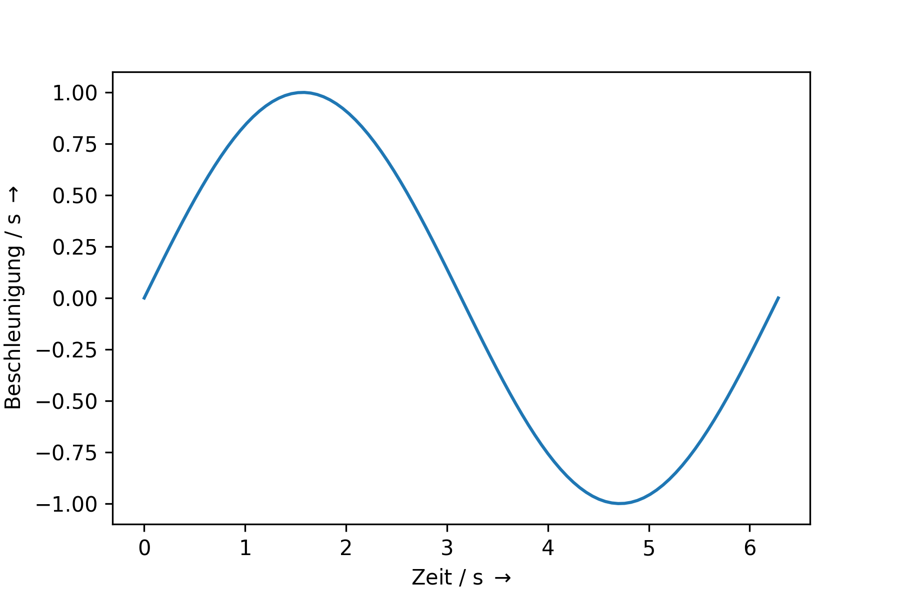

# Kinetik

Ist die Summe der angreifenden Kräfte $\not = 0$ resultiert dies in einer Beschleunigung $\vec{a} = \frac{\vec{F}}{m}$, die eine Änderung der Geschwindigkeit erzeugt, da für $\vec{a} \not = 0$ gilt

$\vec{v}(t) = \vec{a} \cdot t + \vec{v}_0$

Die in der Kinematik verwendeten Bewegungsgleichungen lassen sich durch die Betrachtung der Kräftebilanzen herleiten. 
Im Folgenden wird dies an Beispielen dargestellt. 

Die Betrachtung der Kräftebilanzen führt dazu, dass sich über $F = m \cdot a = c \cdot \ddot{x}$ die Bewegungsgleichung bestimmen lässt. 


## Federpendel
Dies lässt sich anhand des Federpendels erläutern. Dies ist ähnlich zu Federwaage, mit dem Unterschied, dass nun kein statisches Gleichgewicht, sondern ein dynamischer Vorgang betrachtet wird. Dies ist in  {numref}` Abbildung %s <federpendel-2>` dargestellt.

```{figure} Bilder/Federpendel.png
---
width: 900px
name: federpendel-2
---
Federpendel. 
 ```

 Nun gilt:
$\vec{F}_{ges} = m \cdot \vec{a} = m \cdot \ddot{\vec{x}}$

Damit ergibt sich

$\vec{F}_{ges} =F_{F,x} + F_{g,x} \Leftrightarrow  m \cdot \ddot{\vec{x}} = - k \cdot \vec{x} + m \cdot \vec{g} $

Der konstante Term $m \cdot \vec{g}$ erzeugt lediglich eine konstante Verschiebung entlang der x-Achse. Mit der Transformation 

$\tilde{x} = x - \frac{m \cdot g}{k} \Rightarrow \dot{\tilde{x}} = \dot{x} \Rightarrow \ddot{\tilde{x}} = \ddot{x} $

Damit vereinfacht sich die DGL zu

$ m \cdot \ddot{\vec{\tilde{x}}} = - k \cdot \vec{\tilde{x}} \Leftrightarrow \ddot{\vec{\tilde{x}}} + \frac{k}{m} \vec{\tilde{x}} = 0$

Lösungsansatz für DGL:

$\tilde{x}(t) = c \cdot e^{\lambda t} $

$\Rightarrow \dot{\tilde{x}}(t) 
= c \cdot \lambda \cdot e^{\lambda \cdot t} \Rightarrow \ddot{\tilde{x}}(t) =  c \cdot \lambda^2 \cdot e^{\lambda \cdot t} \Rightarrow \ddot{\tilde{x}}(t) $

Einsetzen in DGL

$\Rightarrow c \cdot \lambda^2 \cdot e^{\lambda \cdot t}  + \frac{D}{m}c \cdot e^{\lambda \cdot t} =0 \Rightarrow c \cdot e^{\lambda \cdot t} \left(\lambda^2 + \frac{k}{m}\right)$

$\Rightarrow \lambda^2 + \frac{k}{m} = 0 \Rightarrow \lambda = \pm \sqrt{-\frac{k}{m}} = \pm i \sqrt{\frac{k}{m}} =:\pm i \omega_0 $

$\Rightarrow \tilde{x}(t) = c_1 e^{i \omega_0  t} + c_2 e^{- i \omega_0  t}$

Bestimmung der Konstanten aus Randbedingungen 

$\tilde{x}(t=0) = 0$

$\Rightarrow 0 = c_1 + c_2 \Leftrightarrow c_1 = -c_2 =:c$

$\Rightarrow \tilde{x}(t) = c \left( e^{i \omega_0 t} - e^{-i \omega_0 t}\right) = c \cdot sin \left(\omega_0 t\right)$

Bei $\tilde{x} \left(t \cdot \omega_0 = \frac{\pi}{2} \right) = - \tilde{x}_{max} = - \hat{\tilde{x}}$

$\Rightarrow \tilde{x}(t) = - \hat{\tilde{x}} \cdot sin \left(\omega_0 t\right)$


|Position x &nbsp;&nbsp;&nbsp;&nbsp;&nbsp;&nbsp;&nbsp;&nbsp;&nbsp;&nbsp;&nbsp;&nbsp;&nbsp;&nbsp;&nbsp;&nbsp;&nbsp;&nbsp; | Geschwindigkeit | Beschleunigung|
|- | - | -|
| | ||

Wie man sieht, ergibt sich eine Vorschrift für eine Bewegungsgleichung, die wir in der Kinematik als bekannt vorausgesetzt haben. Mit Hilfe der Dynamik lassen sich also Bewegungsgleichungen herleiten, in dem das Zusammenspiel der wirkenden Kräfte betrachtet wird. 

## Schiefe Ebene

Im Folgenden wird ein weiteres Beispiel betrachtet, welches vielfache praktische Anwendung findet, die Schiefe Ebene. Betrachtet wird hier eine Masse, welche entlang einer geneigten (schiefen) Ebene herabrutscht. Die Gewichtskraft wirkt in diesem Fall nicht entlang der Bewegungrichtung, sondern sie schließt einen Winkel mit dieser ein ({numref}`Abbildung %s <schiefe_ebene-2>`).

```{figure} Bilder/schiefe_ebene.png
---
width: 900px
name: schiefe_ebene-2
---
Schiefe Ebene. 
 ```

 In diesem Fall ist es ungünstig die Kräftebilanz entlang der x- und y-Achse zu betrachten, da hier - im Gegensatz zum schiefen Wurf -  die Bewegungen in diese Achsen nicht unabhängig voneinander sind. Die Bewegung ist durch die schiefe Ebene verknüpft. 
 Es ist einfacher in ein Koordinatensystem zu wechseln, in dem die Achsen entlang der schiefen Ebene ($s_\parallel$-Achse) und senkrecht dazu gelegt werden ($s_\perp$-Achse). 

 Dann gilt 

$F_\parallel = F_g \cdot sin \left( \alpha \right) = mg \cdot sin \left( \alpha \right)$

$F_\perp = F_g \cdot cos \left( \alpha \right) = mg \cdot cos \left( \alpha \right) $

In $s_\parallel$-Richtung gilt dann

$F_\parallel = m \cdot a_\parallel = m g \cdot sin \left( \alpha \right)$

Daraus lässt sich die Bewegungsgleichung in $s_\parallel$-Richtung herleiten

$m \cdot a_\parallel = m g \cdot sin \left( \alpha \right) \Leftrightarrow a_\parallel = g \cdot sin \left( \alpha \right)$

$v_\parallel (t) = a_\parallel \cdot t + v_{\parallel,0}$

$s_\parallel (t) = \frac{1}{2} \cdot a_\parallel \cdot t^2 + v_{\parallel,0} \cdot t + s_{\parallel,0}$

In $s_\perp$-Richtung herrscht statisches Kräftegleichgewicht

$F_\perp = mg \cdot cos \left( \alpha \right) = F_{Boden} \Rightarrow s_\perp = s_{\perp,0}$
